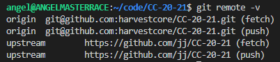
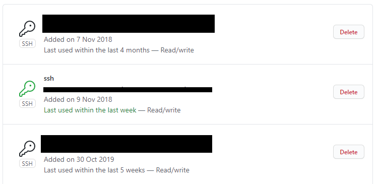
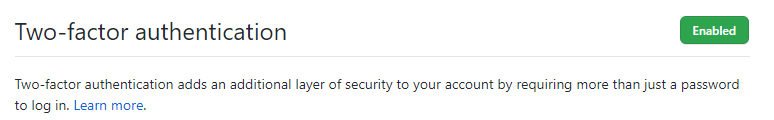

# Basic git/GitHub/repo configuration

> This document includes the different configuration made in git, GitHub and in this repo.

## CC-20-21 repo config

The following image shows the different remotes configured in my CC-20-21 fork. The upstream one was configured by using:

```bash
git remote add upstream https://github.com/jj/CC-20-21
```



## GitHub SSH key

This is the SSH key I have configured (quite a while ago) in my GitHub account.



## GitHub 2FA

